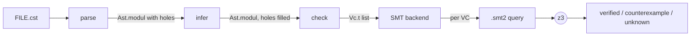

# Caml\* — a simplified, stratified, dependently-typed clone of F\*

Caml\* keeps F\*'s purely-functional dependently-typed **core** — inductive datatypes,
recursion, HM polymorphism, refinement types, lemmas/axioms — and drops everything
else (state, effects, monads, the Tot/WP effect system, universes, tactics).

The defining design constraint is **strict stratification of types and terms**:

```
T   ::= { v:B | φ }            refined base type
      | x:T -> T               dependent function type
B   ::= int | bool | float | unit | string | 'a | T .. T TyCon
φ   ::= first-order formula over quantifiers + well-typed terms
```

Terms are never parametric over types (no first-class types, hence **no universes**),
but types may be parametric over other types **and** may be refined by first-order
propositions over well-typed terms (à la Liquid Haskell / F\* refinements).

Verification is discharged by **relational abstraction** to EPR + z3, following
[Raven](../raven) (a dependent refinement checker for Rust). This document walks the
whole pipeline and then traces `tests/prop8.cst` end-to-end to the two SMT2 queries.

---

## 1. The pipeline at a glance



| Stage | Entry point | Input → Output |
|-------|-------------|----------------|
| **parse** | `Parse.parse_file` | text → `Ast.modul` (name-resolved, desugared, type holes = `None`) |
| **infer** | `Infer.infer_module` | fills every binder/scheme hole with an *erased shape* (HM) |
| **check** | `Check.check_module` | bidirectional refinement checking → `Vc.t list` (subtyping obligations) |
| **backend** | `Smt.solve_module` | each `Vc.t` → self-contained SMT-LIB2, solved with z3 |

The driver `camlstar` (`main.ml`) chains these and reports results.

---

## 2. Module inventory

### Front end

| Module | Role |
|--------|------|
| `ast.ml[i]` | The core **stratified AST**: `base_typ`, `typ` (`T_refine`/`T_arrow`), `term` (`Tm_var`/`Tm_fvar`/`Tm_const`/`Tm_abs`/`Tm_app`/`Tm_let`/`Tm_match`/`Tm_ascribed`/`Tm_quant`), `sigelt` (`Sig_inductive`/`Sig_let`/`Sig_val`/`Sig_assume`/`Sig_pragma`/`Sig_fail`). Binders are **named** with a globally-unique `vid`. Smart constructors (`mk_and`, `mk_eq`, `mk_forall`, `mk_squash`, …) and debug printers. |
| `lexer.mll` | `ocamllex` lexer (nested comments, `//` lines, operators, pragmas, `[@@ ]`). |
| `parser.mly` | `menhir` grammar that builds the `Ast` **directly** in its actions: resolves names to `vid`s, and desugars sugar **in place** — `Lemma(ensures q)` → `squash q` = `{_:unit | q}`, `assert`/`assume`, `if` → `match` on `bool`, `x:B{φ}` refinements, `(e <: T)` ascriptions. |
| `parse.ml[i]` | `parse_string` / `parse_file` wrappers; `Parse_error`. |

### Type inference (Hindley–Milner over *shapes*)

| Module | Role |
|--------|------|
| `unify.ml[i]` | The inference-time **shape** language `ityp` (refinements erased, arrows non-dependent) and **metavariables**, with numeric-constrained unification (`+ - * …` are `∀'n∈{int,float}`, defaulting to `int`). Kept entirely out of `Ast`. |
| `shape.ml[i]` | The `Ast.typ ↔ Unify.ityp` bridge: `erase` (drop refinements), `reflect` (trivial refinements), plus `unify_shape` and `match_typ` (one-sided tyvar instantiation used by the checker). |
| `infer.ml[i]` | **Algorithm-W** over `Ast`. Works on shapes only (φ is not checked here). Fills the holes in place: every `Tm_abs.xtyp`, `Tm_quant.qty`, and `letbinding.lb_scheme` gets a type. |

### Refinement checking

| Module | Role |
|--------|------|
| `subst.ml[i]` | Capture-avoiding **substitution** by binder-freshening: `subst_term` (term-for-term, drives `T2[x:=e]`), `subst_tyvars` (type-for-tyvar, drives polymorphic instantiation, with the refinement-base merge), `freshen_*`, `free_vars_*`, `alpha_equal_*`. |
| `vc.ml[i]` | The **verification-condition** type: a self-contained typed sequent `{ decls; axioms; scope; hyps; goal; range; reason }`, valid iff `∀ scope. (⋀ axioms ∧ ⋀ hyps) ⟹ goal`. Plus `string_of_t`. |
| `check.ml[i]` | The **bidirectional refinement checker**. `synth` (with *selfification*: constants/vars/applications get `{v:B | v = e}` singletons), `check` (push an expected type inward), and `subtype Γ ⊢ S <: T` — the actual VC generator. `match` binds pattern fields **and** emits the discriminator hypothesis `scrut = C(fields)`. Trivial VCs (goal ≡ `true`) are dropped. |

### SMT backend (relational abstraction)

| Module | Role |
|--------|------|
| `smtlib.ml[i]` | Renders a *pipeline-normalised* `Ast.term` to an SMT-LIB2 s-expression; `base_typ` → sort (`Int`/`Bool`/`Real`/`String` builtin, `UI_T` for datatypes/tyvars); classifies symbols (`is_interpreted`, `is_connective`, `is_relation`). |
| `axioms.ml[i]` | The **relational encoding** (port of `raven/backend/src/smt/axioms.rs`): each constructor → a relation `C_rel` (0-ary → a constant) with **functionality / injectivity / disjointness**; each function → a relation `f_rel` with functionality; **definitional equations** for unspecified functions (`generate_axioms_from_body`); the `ret_sort` table. |
| `anf.ml[i]` | **A-Normal Form**: hoists every *abstract* call (user function / constructor — not an interpreted op, not an `_rel`) into `let x = f(atoms) in …`. |
| `nnf.ml[i]` | **Negation Normal Form**: eliminates `==>`/`<==>`, pushes `~` to atoms (De Morgan + quantifier flipping), threads through lets. |
| `relabs.ml[i]` | **Relational Abstraction** (port of `raven/backend/src/relabs.rs`): `let x = f(a) in body` becomes `∀x. f_rel(a,x) ⇒ body` (positive) / `∃x. f_rel(a,x) ∧ body` (negative). `transform_neg` is used for auto-instantiation. |
| `smt.ml[i]` | The **driver**. Assembles a self-contained query per VC: sort/relation declarations, the already-relational axioms verbatim, the definitional equations through ANF→NNF→relabs, the **auto-instantiation** (materialisation of ground applied subterms — the analogue of `raven/frontend/src/auto_inst.rs`), and the transformed negated sequent; then invokes z3 and parses `unsat`/`sat`/`unknown`. |
| `main.ml` | The `camlstar` CLI: `--print-vcs`, `--solve`, `--dump-smt DIR`. |

The **interpreted / abstract split** is the one Caml\*-specific twist relative to Raven
(which has no integers): interpreted arithmetic/logic (`+ < = /\ …`) stays **native** to
SMT; only user constructors and functions are relationally abstracted. `is_interpreted`
draws that line and is reused across `check`, `anf`, and `relabs`.

---

## 3. Worked example: `tests/prop8.cst`

The classic TIP benchmark #8: over `Peano` naturals, `sub(add(i,j), add(i,k)) = sub(j,k)`,
proved by induction on `i`.

```fstar
module Prop8

type nat =
  | Z: nat
  | S: nat -> nat

let rec add x y = match x with
  | Z -> y
  | S x' -> let p = add x' y in S p

let rec sub x y = match x with
  | Z -> Z
  | S x' -> match y with
    | Z -> x
    | S y' -> sub x' y'

val tip_eight: i:nat -> j:nat -> k:nat ->
        Lemma(ensures sub (add i j) (add i k) = sub j k)
let rec tip_eight i j k = match i with
  | Z -> ()
  | S i' -> tip_eight i' j k
```

### 3.1 Parse → Infer

`Infer.infer_module` fills every binder type and let scheme (refinements are *erased* —
inference works on shapes). Note the `Lemma(ensures …)` in the `val` has desugared to a
`squash` refinement, while the `let`'s reflected scheme keeps only the erased shape
(`… -> unit`):

```
let rec add : _:nat -> _:nat -> nat = fun (x:nat) -> fun (y:nat) -> match x with
  | Z -> y
  | S x' -> let p : nat = add x' y in S p

val tip_eight : i:nat -> j:nat -> k:nat -> squash ((sub (add i j) (add i k)) = (sub j k))
let rec tip_eight : _:nat -> _:nat -> _:nat -> unit = fun (i:nat) -> ... match i with
  | Z -> ()
  | S i' -> tip_eight i' j k
```

Because the refined spec lives on the **`val`** (not the reflected `let` scheme), the
checker checks `tip_eight`'s body against the `val` type. `add`/`sub` have no `val` and no
refinement — they are the *unspecified* functions that will get definitional equations.

### 3.2 Check → the two VCs

`Check.check_module` checks the body `match i with | Z -> () | S i' -> tip_eight i' j k`
against `i:nat -> j:nat -> k:nat -> {_:unit | sub(add i j)(add i k) = sub j k}`. One VC per
`match` arm; each arm contributes its **discriminator hypothesis**, and the recursive call
is *selfified* so its result carries the spec (the induction hypothesis):

```
(* VC1 — base case: i = Z *)
  var i : nat   var j : nat   var k : nat   var v : unit
  hyp  i = Z
  hyp  v = ()
  ⊢    (sub (add i j) (add i k)) = (sub j k)

(* VC2 — step case: i = S i' *)
  var i : nat   var j : nat   var k : nat   var i' : nat   var v : unit
  hyp  i = (S i')
  hyp  ((sub (add i' j) (add i' k)) = (sub j k))   /\   (v = (tip_eight i' j k))
  ⊢    (sub (add i j) (add i k)) = (sub j k)
```

`sub (add i' j) (add i' k) = sub j k` in VC2's hypothesis is the **induction hypothesis**,
recovered by selfification of the recursive call `tip_eight i' j k`.

### 3.3 Backend — how each VC becomes SMT2

For a VC the backend builds one self-contained query with these sections (all emitted by
`Smt.build_query`):

1. **Preamble + declarations.** The `Unit` sort; the datatype sort `UI_nat`; the 0-ary
   constructor `Z` as a **constant**; the constructor relation `S_rel`; the function
   relations `add_rel`, `sub_rel`, `tip_eight_rel`; and the VC's scope variables as
   `declare-const` skolems (`i_29`, `j_30`, `k_31`, `v_111`).

2. **Datatype axioms** (`Axioms.datatype_axioms`, asserted verbatim — already relational):
   functionality, injectivity, and disjointness of `S`/`Z`.

3. **Function functionality** (`Axioms.function_axioms`): `add_rel`, `sub_rel`,
   `tip_eight_rel` are deterministic.

4. **Definitional equations** (`Axioms.definitional_axioms`, one per `match` leaf of
   `add`/`sub`), each pushed through **ANF → NNF → relabs**. E.g. the arm
   `add (S x') y = S (add x' y)` becomes, after ANF flattens the nested calls and relabs
   turns each `let` into a `∀ … ⇒`:

   ```
   ∀ y x'.  S_rel(x', a) ⇒ add_rel(a, y, b) ⇒ add_rel(x', y, c) ⇒ S_rel(c, d) ⇒ b = d
   ```

5. **Auto-instantiation** (`Smt.materialization`, the analogue of `auto_inst.rs`): the
   *ground* applied subterms of the VC — the abstract calls ANF hoisted to top level, i.e.
   those **not** under a quantifier — are materialised as an existential chain
   `∃v. f_rel(atoms, v) ∧ …`, so the universal axioms above have ground terms to fire on.

6. **The negated sequent** `(⋀ hyps) ∧ ¬goal`, run through **ANF → NNF → relabs** at
   positive polarity: every function application in it becomes a `∀ … ⇒`, with the negated
   equality (`not (= …)`) at the leaf.

`unsat` of the whole query means the sequent is valid (the VC is discharged).

### 3.4 VC1 (base case) — the actual SMT2, annotated

```smt2
(set-logic ALL)
(declare-sort Unit 0)
(declare-const unit_val Unit)

;; ── datatype nat ─────────────────────────────────────────────
(declare-sort UI_nat 0)
(declare-const Z UI_nat)                        ; 0-ary constructor → constant
(declare-fun S_rel (UI_nat UI_nat) Bool)        ; S(x)=r

;; ── function relations ───────────────────────────────────────
(declare-fun add_rel (UI_nat UI_nat UI_nat) Bool)
(declare-fun sub_rel (UI_nat UI_nat UI_nat) Bool)
(declare-fun tip_eight_rel (UI_nat UI_nat UI_nat Unit) Bool)

;; ── VC scope (universally-quantified vars → skolem constants) ─
(declare-const i_29 UI_nat) (declare-const j_30 UI_nat)
(declare-const k_31 UI_nat) (declare-const v_111 Unit)

;; ── datatype axioms: S functionality / injectivity / S≠Z ─────
(assert (forall ((in_167 UI_nat)) (forall ((r1_168 UI_nat)) (forall ((r2_169 UI_nat))
  (=> (and (S_rel in_167 r1_168) (S_rel in_167 r2_169)) (= r1_168 r2_169))))))
(assert (forall ((x_161 UI_nat)) (forall ((y_162 UI_nat)) (forall ((r_163 UI_nat))
  (=> (and (S_rel x_161 r_163) (S_rel y_162 r_163)) (= x_161 y_162))))))
(assert (forall ((in_174 UI_nat)) (forall ((r_173 UI_nat))
  (=> (S_rel in_174 r_173) (not (= r_173 Z))))))

;; ── function functionality: add / sub / tip_eight deterministic
(assert (forall ((in_135 ..)(in_136 ..)(r1_137 ..)(r2_138 ..))
  (=> (and (add_rel in_135 in_136 r1_137) (add_rel in_135 in_136 r2_138)) (= r1_137 r2_138))))
(assert ... sub_rel functionality ...)
(assert ... tip_eight_rel functionality ...)

;; ── definitional equations of add (2 arms) and sub (3 arms) ───
;; add(Z,y) = y
(assert (forall ((y_13 ..)) (forall ((anf_187 ..))
  (=> (add_rel Z y_13 anf_187) (= anf_187 y_13)))))
;; add(S x', y) = S(add x' y)
(assert (forall ((y_13 ..)(x__14 ..))
  (forall ((anf_189 ..)) (=> (S_rel x__14 anf_189)
  (forall ((anf_190 ..)) (=> (add_rel anf_189 y_13 anf_190)
  (forall ((anf_191 ..)) (=> (add_rel x__14 y_13 anf_191)
  (forall ((anf_192 ..)) (=> (S_rel anf_191 anf_192) (= anf_190 anf_192)))))))))))
;; sub(Z,y) = Z
(assert (forall ((y_18 ..)) (forall ((anf_197 ..))
  (=> (sub_rel Z y_18 anf_197) (= anf_197 Z)))))
;; sub(S x', Z) = S x'
(assert ... )
;; sub(S x', S y') = sub(x', y')
(assert ... )

;; ── auto-instantiation: materialise the goal's ground subterms ─
;;   add(i,j), add(i,k), sub(add(i,j),add(i,k)), sub(j,k)
(assert (exists ((anf_123 ..)) (and (add_rel i_29 j_30 anf_123)
        (exists ((anf_124 ..)) (and (add_rel i_29 k_31 anf_124)
        (exists ((anf_125 ..)) (and (sub_rel anf_123 anf_124 anf_125)
        (exists ((anf_126 ..)) (and (sub_rel j_30 k_31 anf_126) true)))))))))

;; ── negated sequent: (i = Z ∧ v = ()) ∧ ¬(sub(add i j)(add i k) = sub(j,k)) ─
(assert (and (and (= i_29 Z) (= v_111 unit_val))
  (forall ((anf_123 ..)) (=> (add_rel i_29 j_30 anf_123)
  (forall ((anf_124 ..)) (=> (add_rel i_29 k_31 anf_124)
  (forall ((anf_125 ..)) (=> (sub_rel anf_123 anf_124 anf_125)
  (forall ((anf_126 ..)) (=> (sub_rel j_30 k_31 anf_126)
                            (not (= anf_125 anf_126)))))))))))
(check-sat)
```

**Why it is `unsat` (verified).** From `i = Z`: the materialised `add_rel(Z,j,anf_123)`
plus the defeq `add(Z,y)=y` forces `anf_123 = j`; likewise `anf_124 = k`. Then
`sub_rel(anf_123,anf_124,anf_125) = sub_rel(j,k,anf_125)` and `sub_rel(j,k,anf_126)`; by
`sub` functionality `anf_125 = anf_126`. The negated goal instantiated at these ground
witnesses demands `anf_125 ≠ anf_126` — a contradiction. z3 returns **`unsat`**.

### 3.5 VC2 (step case) — what differs

VC2 is structurally identical but:

- The scope has an extra skolem `i__32` (the pattern variable `i'`), and the hypothesis is
  the **discriminator** `i = S i'` — encoded as `∀anf. S_rel(i__32, anf) ⇒ i_29 = anf`.
- The hypothesis conjunction also carries the **induction hypothesis**
  `sub(add(i',j),add(i',k)) = sub(j,k)` and `v = tip_eight(i',j,k)`, each relationally
  abstracted.
- The **auto-instantiation** chain is longer — it materialises `S(i')`, `add(i',j)`,
  `add(i',k)`, `sub(add(i',j),add(i',k))`, `sub(j,k)`, `tip_eight(i',j,k)`, `add(i,j)`,
  `add(i,k)`, `sub(add(i,j),add(i,k))`:

  ```smt2
  (assert (exists ((anf_213 UI_nat)) (and (S_rel i__32 anf_213)
          (exists ((anf_214 UI_nat)) (and (add_rel i__32 j_30 anf_214)
          ... exists chain over all 9 ground subterms ... true)))))
  ```

z3 returns **`sat`** (a counterexample). This is the *expected* incompleteness: closing the
step needs the term `S(add(i',j))` (to fire the `add(S x',y)=S(add x' y)` equation on
`add(i,j) = add(S i',j)`), but `S(add(i',j))` is **not** a syntactic subterm of the VC, so
auto-instantiation never materialises it. In Raven this is supplied by an explicit
`instantiate!(Nat::S(add(i_prime, j)))` hint — deferred in Caml\*.

### 3.6 Soundness note: relations over-approximate functions

Every function `f` is encoded as a **relation** `f_rel` with only a *functionality* axiom —
we deliberately do **not** assert totality (`∀x. ∃y. f_rel(x,y)`), because that
∀∃-alternation would leave the decidable EPR fragment. Consequently the relations
**over-approximate** the functions, and z3 can answer `sat` with a spurious model in which a
relation is empty at some point. Auto-instantiation removes this for every ground term that
appears syntactically; genuinely creative steps still require hints. So a `sat` from
`camlstar --solve` means *"not proved"* (possibly spurious), not *"refuted"*.

---

## 4. Running it

```sh
# build
dune build

# generate + pretty-print the VCs (writes tests/prop8.vcs)
dune exec ./main.exe -- --print-vcs tests/prop8.cst

# solve with z3 and report per-VC verdicts
dune exec ./main.exe -- --solve tests/prop8.cst

# also dump each self-contained SMT2 query
dune exec ./main.exe -- --solve --dump-smt /tmp/smt tests/prop8.cst
```

The z3 binary is `$CAMLSTAR_Z3` (default `z3`). Expected output for `prop8.cst`:

```
  [verified] definition of tip_eight        (VC1, base case)
  [counterexample] definition of tip_eight  (VC2, step case — needs a hint)
1 verified, 1 counterexamples, 0 unknown, 0 errors (of 2 VCs)
note: unverified VCs may be spurious (relational abstraction overapproximates functions)
```

`tests/checker.cst` (pure-arithmetic refinements) verifies 4/4 — those VCs have no abstract
calls, so the relational machinery is a no-op and z3 decides them directly.

### Other executables

```sh
dune exec ./parse_test.exe -- tests/list.cst      # print the parsed Ast
dune exec ./infer_test.exe -- tests/infer_ok.cst  # print the inference-filled Ast
```

---

## 5. Status & deferred work

**Implemented:** the full parse → infer → check → relational-abstraction → z3 pipeline,
including datatype encoding, discriminator hypotheses, definitional equations for
unspecified functions, ANF/NNF/relabs, and auto-instantiation of ground subterms.

**Deferred:**
- `instantiate!`-style hints for creative inductive steps (VC2 above).
- The EPR sort-cycle decidability check (`raven/backend/src/epr_check.rs`).
- Polymorphic-datatype monomorphisation (tyvars currently map to per-name uninterpreted
  sorts); partial evaluation/inlining; tuple flattening; counterexample pretty-printing.
